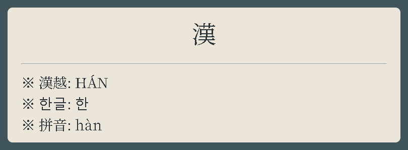
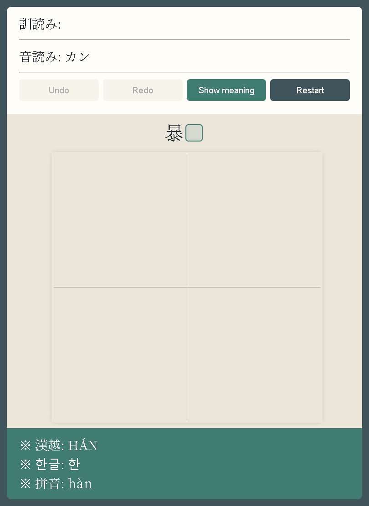

# Ultimate Kanji Writing Anki Deck

Ultimate Kanji Writing is an Anki deck for learning Japanese kanji, reviewing
readings and meanings, and practicing stroke order. It includes multilingual
references, stroke diagrams, vocabulary examples, and an interactive writing
card.

[Download v1.2.0](https://github.com/rarohci/UltimateKanjiWritingAnkiDeck/releases/tag/v1.2.0)
· [Usage guide](HOW_TO_USE.md)
· [Limitations and disclaimer](DISCLAIMER.md)
· [Report a problem](https://github.com/rarohci/UltimateKanjiWritingAnkiDeck/issues)

## v1.2.0 contents

| Item | Count or value |
| --- | --- |
| Kanji notes | 6,396 |
| Cards | 12,792 — two cards per note |
| Note type | `japanese+` |
| Card types | `learningCard` and `writingCard` |
| WaniKani subdecks | 60 |
| No-vocabulary subdeck | 1,006 notes / 2,012 cards |
| Vocabulary entries | 56,089 across 5,390 notes |
| Package | `ultimateKanjiWritingAnkiDeck.apkg` |

The package also contains 6,396 SVG media files and the Noto Serif JP font.
All cards are new when the package is generated; it contains no review history.

## Card previews

Screenshots of the actual front templates using the 漢 note from the deck.





## Install

1. Open Anki.
2. Select **File → Import**.
3. Choose `ultimateKanjiWritingAnkiDeck.apkg`.
4. Confirm the import and select the destination collection.

AnkiDroid users can open the same `.apkg` from the device or import it through
Anki Desktop and synchronize.

For the complete walkthrough, see [HOW_TO_USE.md](HOW_TO_USE.md).

## Using Anki's SRS for memorization

The deck uses Anki's scheduler to decide when each card returns. The learning
and writing cards are separate cards, so Anki schedules them independently.
This lets you recognize a kanji before requiring accurate written recall.

For a balanced starting setup, open the deck's **Options** and use:

- **FSRS:** enable it when available and start with a desired retention of
  about **90%**. Re-optimize after you have accumulated real review history.
- **Learning steps with FSRS:** a short step such as `10m` is a starting
  example; avoid steps of one day or longer.
- **Relearning steps:** `10m` is a useful default after a failed review.
- **New cards:** begin with a manageable daily card limit and adjust to your
  workload. Limits count cards, and this deck has two cards per kanji.
- **Bury siblings:** enable burying new and review siblings so the learning and
  writing cards for the same note do not appear back-to-back.

These are optional starting points, not required deck settings. See the
[official deck-options guide](https://docs.ankiweb.net/deck-options.html#fsrs)
for current FSRS guidance. Create a separate options preset if you do not want
changes to affect other decks sharing the same preset.

Use **Again** when you could not recall the character or its meaning, **Hard**
when the answer was uncertain or slow, **Good** when recall was comfortable,
and **Easy** only when the answer was immediate. On a writing card, choose the
grade based on whether you produced the stroke order from memory; do not mark a
card Easy just because the visual hint made it easier.

For stronger writing retention, study the learning card first, then attempt the
writing card before pressing **Show Answer**. If the stroke order is repeatedly
wrong, use **Again** and redraw it once while the reference is visible. Keep the
writing card in the same deck as its learning sibling so both follow the same
long-term review plan.

If reviews become too heavy, reduce the daily new-card limit or suspend a small
set of difficult cards temporarily. Avoid resetting the entire deck; that
removes the scheduling history that makes SRS useful.

## Learning cards

The learning card shows the character and multilingual readings on the front.
Its answer includes the stroke diagram, Japanese readings, meanings,
Vietnamese explanations, radicals, components, related characters, and
vocabulary.

## Writing cards

The writing card uses the bundled Hanzi Writer library and checks each accepted
stroke against the note's SVG stroke data.

- **Undo** removes the last accepted stroke.
- **Redo** restores an undone stroke.
- **Restart** clears the drawing and chooses another matching vocabulary hint
  when more than one is available.
- **Show meaning / Show reading** switches the prompt.

Rejected strokes do not enter the Undo history. These controls affect the
current practice session, not Anki's review scheduling.

The writing hint masks the current kanji with a square. Tap or click the hint
to open its reading and meaning popup; tap again, click outside, or press
**Escape** to close it. Long definitions scroll inside the popup.

## Deck organization

The main deck is `ultimateKanjiWritingAnkiDeck`. WaniKani level subdecks are
under it. Notes without vocabulary are placed in:

```text
ultimateKanjiWritingAnkiDeck::noVocabsKanji
```

The no-vocabulary deck is useful when studying characters that do not have a
word entry in the source data.

## Editing the note type

The editable source templates are in `templates/`:

- `templates/learningCard/` contains learning-card templates.
- `templates/writingCard/` contains writing-card templates.
- `templates/style.css` contains shared styling.

The writing front expects the `svg_data` field to contain JSON with matching
`strokes` and `medians` arrays. The `vocab` field uses one entry per line or
`<br>`:

```text
歓声|かんせい|cheer, shout of joy
歓迎|かんげい|welcome, warm reception
歓喜|かんき|delight, great joy
```

Each entry is `word|reading|meaning`. A meaning may contain additional pipe
characters; they remain part of the meaning.

## AnkiDroid gesture setup

To avoid revealing answers while drawing, open **Settings → Gestures** and set
conflicting tap, double-tap, swipe, and **Answer button 1–4** gestures to
**No action**. Use the explicit **Show Answer** button. Keep AnkiDroid's
built-in whiteboard off while using the writing card.

## Source and license notes

Original project code and documentation are free to use and modify under MIT;
third-party materials retain their own terms. The embedded customized
[Hanzi Writer](https://github.com/chanind/hanzi-writer) v2.2.2 library is by
David Chanin and uses the MIT license; see
[HANZI-WRITER-LICENSE.txt](HANZI-WRITER-LICENSE.txt).

The stroke graphics originate from KanjiVG data and retain their source notices.
See [KANJIVG-LICENSE.txt](KANJIVG-LICENSE.txt) for attribution, license, and
source links.
The included Noto Serif JP font is distributed with its `_NotoSerifJP-OFL.txt`
license file. See [LICENSE.md](LICENSE.md) for the repository license breakdown
and [CHANGELOG.md](CHANGELOG.md) for the v1.2.0 changes.

The origins and redistribution terms of all vocabulary, dictionary definitions,
and multilingual reference fields have not yet been fully documented. The
project's MIT license does not grant rights to those third-party texts.

## Limitations and support

This is an independent community project, not an official Anki or WaniKani
product. Readings and definitions may contain errors or omissions. Handwriting
acceptance is approximate, especially for short, bent, or hooked strokes;
acceptance is not a grade of handwriting quality.

The preview images are browser renders of the current front templates with a
real note. They do not demonstrate compatibility with every client or show the
answer side. See [DISCLAIMER.md](DISCLAIMER.md) for details and reporting
instructions. Back up your collection before importing updates or editing
templates; see the [update guide](HOW_TO_USE.md#updating-an-existing-deck).
